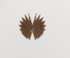
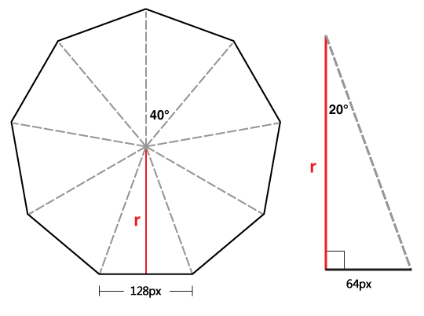

# 3D滚筒

相信我们见过很多3D跑马灯式的轮播图，或者各种各样炫酷的立体效果。    

如这几个：    

[旋转立方体](http://www.htmleaf.com/Demo/201501251274.html)    

[翻书](http://www.htmleaf.com/Demo/20141013169.html)    

[字母卡片开关们](http://www.htmleaf.com/Demo/2014100997.html)    

教程要讲的是这个:    

[真心话滚筒](https://pengjiyuan.github.io/3DRoller/)    

代码在这儿： https://github.com/PengJiyuan/3DRoller    


### 怎么实现

**基本步骤和卡片翻转一致，这个我们只要可以构建出来3D的滚筒，就可以了**    

### 3D的滚筒怎么实现？

每个滚筒的“板子”我们可以设置为长200px，宽40px。    

所以“板子”的载体我们也设置为200px * 40px。    

结构如下：    

```html
<div class="container">
  <div class="wrapper">
    <div></div>
    <div></div>
    ...
  </div>
</div>
```

“板子”用绝对定位，`position: absolute;`

所以我们设定的n张板子就全都重叠在了一起。    

接下来，让每个板子朝向它应该朝向的方向:    

`transform: rotateX(xxxdeg)`    

xxx = 360/“板子”的个数    

那么现在板子的朝向是正确的，但是是“糊”在一块儿的，如下：    

    

因为现在每个“板子”都聚集在一个轴上，我们需要对每个板子向各自的朝向位移一些距离X。    

X怎么得出来？看下图：    

    

X = ((“板子”的宽度 / 2) / Math.tan(0.5 \* xxx \* Math.PI / 180))    

那么，`translateZ('+ rZ +'px);`    

滚筒即可造好。。    


要让滚筒滚动起来，只需要添加点击事件，让“载体wrapper”绕X轴滚动即可。    
`rotateX(xxxdeg)`   


大功告成！
